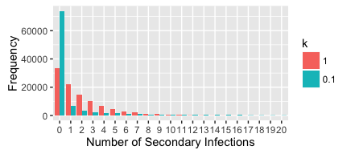
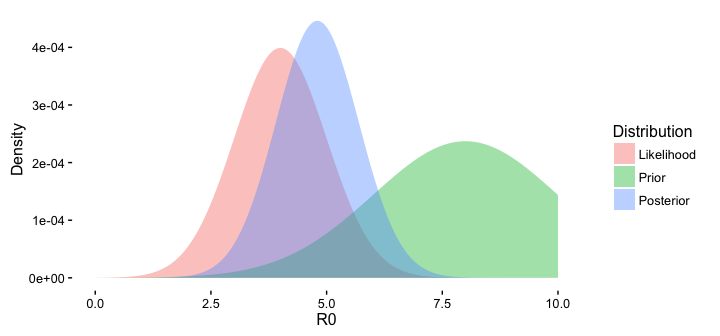
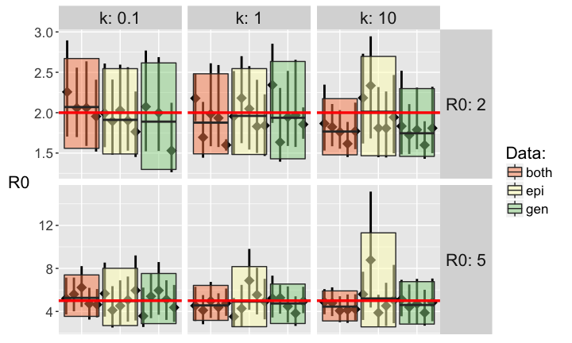
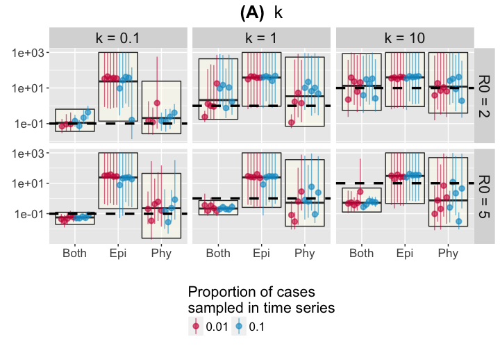
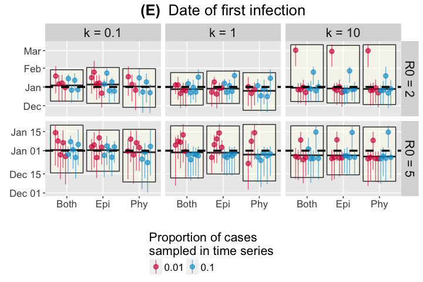
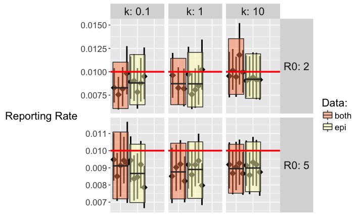
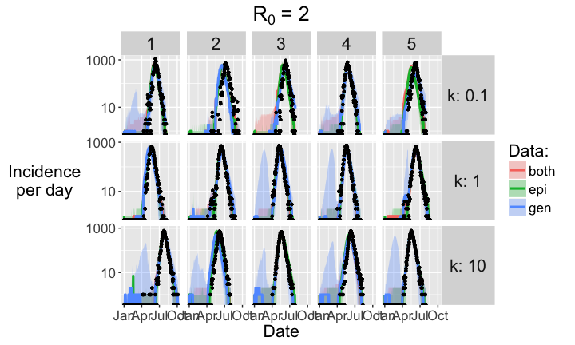
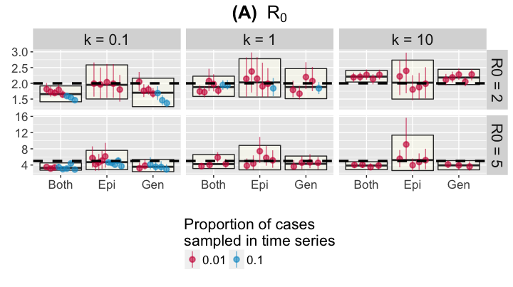
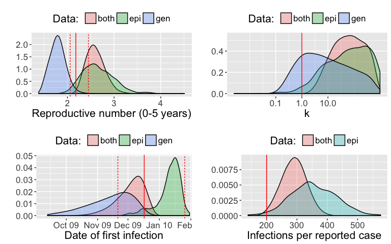

# Background 

## Stochasticity in disease transmission

- Important in outbreak settings and for sparsely sampled infectious diseases
- Heterogeneity in transmission rates --> overdispersed offspring distribution 

<!-- -->

## Incorporating genetic data in epidemiological inference

- Contact tracing information is necessary to directly measure the overdispersion of the offspring distribution - not available for sparsely sampled diseases
- Overdispersion could be estimated from genetic data as it affects pathogen diversity
- Using population genetic models such as the coalescent, we can estimate the effective number of infections $N_e$, is related to the true number of infections via the offspring distribution 

\begin{align}
\lambda = \frac{1}{N_e}
\end{align}

## Phylodynamic inference in epidemiology

\begin{itemize}
\item Aim: Estimate epidemiological parameters from pathogen sequences
\begin{itemize}
\item BEAST (Drummond et al 2012; Bouckaert et al 2014) approaches. 
\end{itemize}
\item Aim: Estimate epidemiological parameters from both epidemiologic data and pathogen sequences
\begin{itemize}
\item Dense sampling: Reconciling transmission tree and phylogenetic tree to track outbreaks of foot-and-mouth (Ypma et al 2013) and tuberculosis (Colijn \& Gardy 2014)
\item Sparse sampling: Fitting stochastic SIR models to Dengue data collected over 6 years (Rasmussen et al 2011, 2014)
\end{itemize}
\end{itemize}

## Aims

<!-- -->

- Bayesian inference of epidemiological parameters by fitting to epidemiologic and genetic data simultaneously
- Quantify heterogeneity in transmission rates
- Account for stochasticity by using particle filtering to approximate the likelihood
- Infer latent variables such as incidence of undetected infections
- Incorporate phylogenetic uncertainty

# Method

## Simulation pipeline

<!-- \begin{columns} -->
<!-- \begin{column}{0.38\textwidth} -->
<!-- \begin{itemize} -->
<!-- \item SIR model with an explicit offspring distribution -->
<!-- \item For $R_0={2, 5}$, $k={0.1, 1, 10}$, reporting rate $\rho={0.01, 0.1}$ -->
<!-- \item Single infector introduced to a wholly susceptible population with 20,000 people -->
<!-- \item 5 replicate simulations -->
<!-- \end{itemize} -->
<!-- \end{column} -->
<!-- \begin{column}{0.58\textwidth} -->
<!-- \begin{figure} -->
<!--    \includegraphics{method_diagram.pdf} -->
<!-- \end{figure} -->
<!-- \end{column} -->
<!-- \end{columns} -->

## Particle MCMC

Particle MCMC (Andrieu et al 2010):

<!--  -->

## Coalescent likelihood calculation

- $\tau\sim$ Exp $(\lambda)$
- $f_G(\tau) = \lambda e^{-\lambda \tau}$
- $\tau$ = time until next coalescent event
- $\lambda$ = rate of coalescence

<!-- -->

## Coalescent likelihood calculation

\begin{align}
\lambda &= \binom{l}{2}\frac{1}{N_e} \\
&= \binom{l}{2} \frac{R_e (1 + \frac{1}{k})}{N T_g}
\end{align}

- $l$ number of lineages at time $t$
- $N_e$ effective number of infections
- $R_e$ effective reproductive number
- $k$ dispersion of a negative binomial offspring distribution
- $N$ number of infectious individuals
- $T_g$ generation time

(Fraser et al, unpublished)

## Likelihood of epidemiologic data

- $x\sim$ Binomial (I, $\rho$)
- I = number of new infections (reported + unreported cases)
- $\rho$ = reporting rate

\begin{align}
f_E(x) = \binom{N}{x} \rho^x (1-\rho)^{N-x}
\end{align}

# Results: simulations

## R0

<!-- -->

## k

<!-- -->

## Date of first infection

<!-- -->

## Reporting rate

<!-- -->

## Epidemic history (incidence over time)

<!-- -->

## Accuracy of trajectories

Correlation between inferred epidemic history and true epidemic history was calculated using Pearson's correlation.

Using genetic data alone led to marginally more uncertainty in epidemic history compared to inference including epidemiologic data.

\begin{table}[ht]
\centering
\begin{tabular}{rrr}
\hline
both & epi & gen \\ 
\hline
0.535 & 0.534 & 0.581 \\ 
\hline
\end{tabular}
\end{table}

## Why estimate k?

<!-- -->

## Phylogenetic uncertainty

- Sampled from Bayesian posterior distribution of phylogenies, and re-estimated parameters using each sampled tree

<!--  -->

## Phylogenetic uncertainty

<!--  -->

# Results: Poliovirus

## Data

- Large outbreak of poliovirus 1 in Tajikistan in 2010 (over 500 reported cases)
- 116 viral sequences were obtained (Yakovenko et al 2014)
- Maximum likelihood parameters values were inferred using reported case time-series, with a fixed reporting rate of 1 in 200 (Blake et al 2014)

Aim: 

- Incorporating viral sequences in inference
- Estimate reporting rate and other parameters while accounting for stochasticity

## Parameter inference

<!-- -->

# Conclusions

## Take-home messages

- Estimation of k is only possible when genetic data are used
- Agreement between parameter estimates using epidemiologic and/or genetic data
- More precise estimates of R0 when both epi and genetic data are used
- Application to poliovirus data revealed some discrepancies in parameter estimates when incorporating genetic data during inference, although estimates are largely consistent
- Phylogenetic uncertainty could be incorporated

## Ongoing work

Analysis of data:

- Environmental poliovirus in Pakistan
- Nigeria cVDPV2
- Ebola outbreak in Liberia

Code:
github.com/lucymli/EpiGenMCMC

## Acknowledgements

- Professors Christophe Fraser and Nicholas Grassly
- Evolutionary Epidemiology Research Group
- Vaccine Epidemiology Research Group

Data:

- CDC and Professor Vadim Agol (MSU)

Funding: 

- MRC studentship
- Imperial HPC resources funded by UK MED-BIO (an MRC project)

 &nbsp; &nbsp; &nbsp; &nbsp; &nbsp; &nbsp; &nbsp; 

